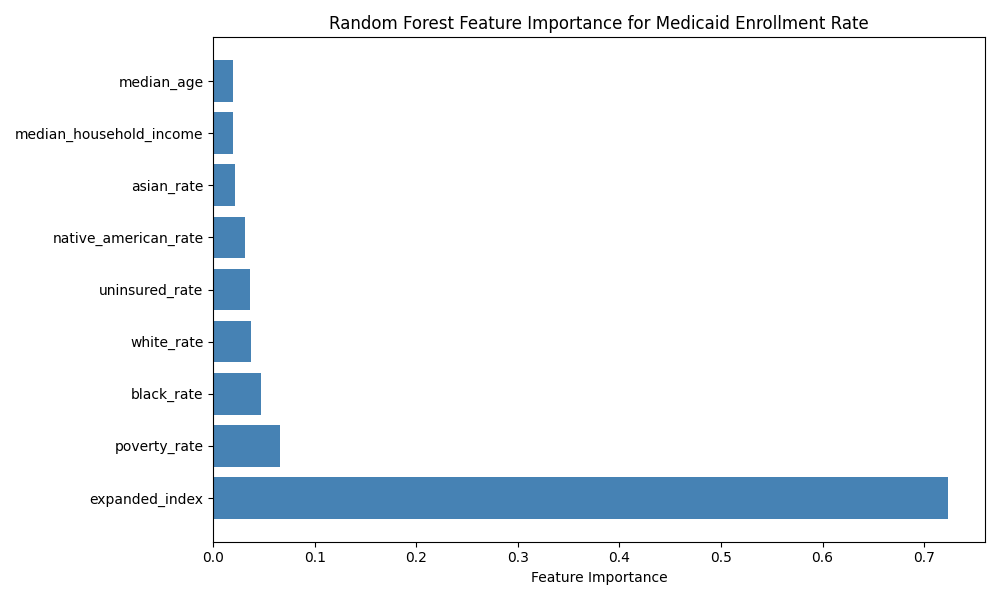
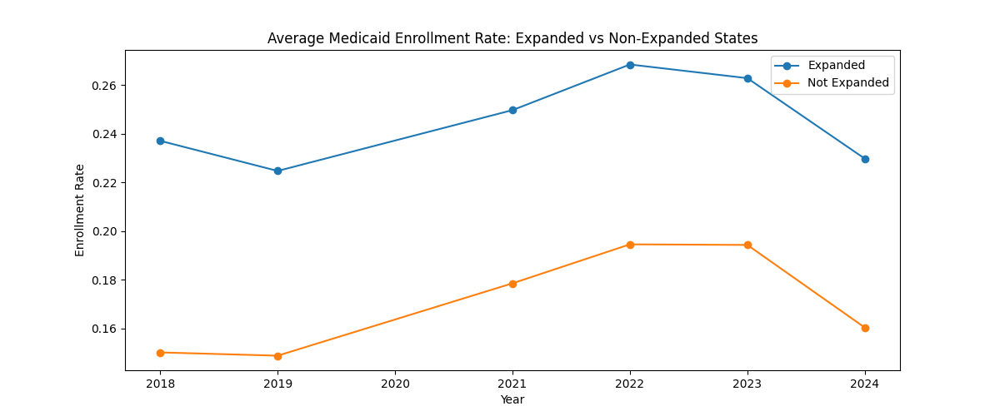
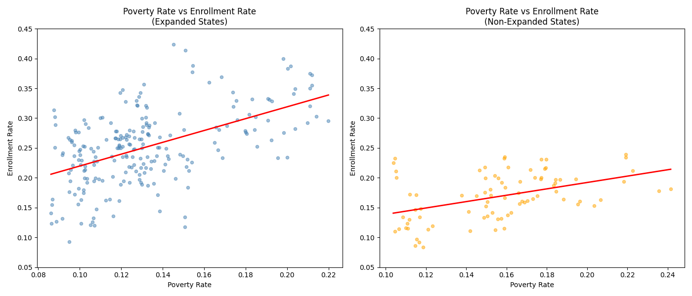
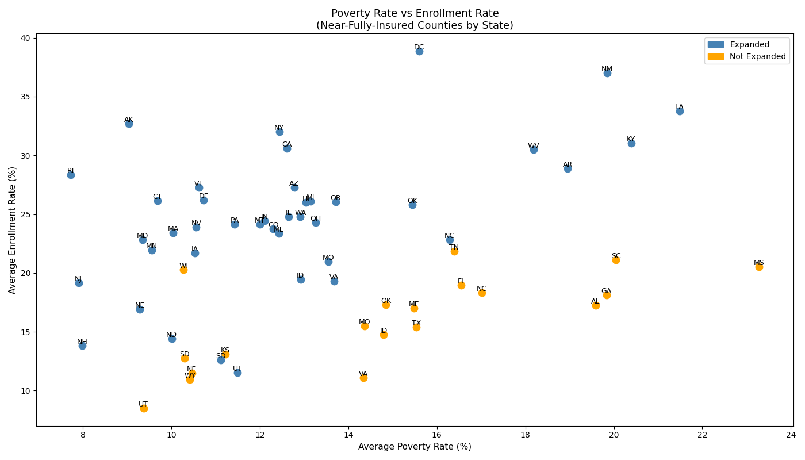
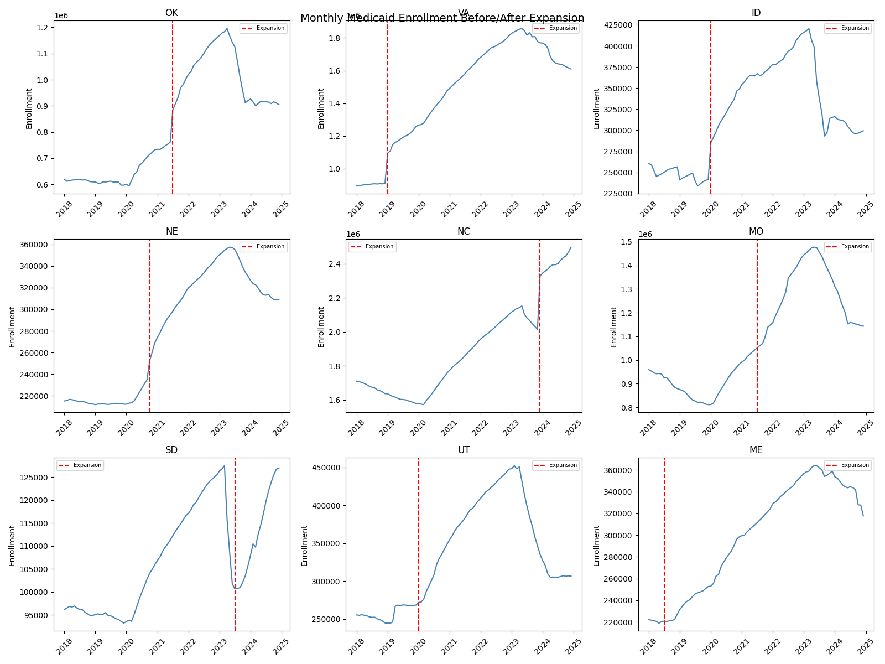

(This project use AWS Academy to generate the final output. Solo project.)

# Medicaid Enrollment and Poverty Analysis Pipeline

## Research Question
This project investigates the determinants of Medicaid enrollment across U.S. counties from 2018 to 2024, with a particular focus 
on the role of Medicaid expansion, poverty, racial composition, and administrative factors in shaping enrollment outcomes. 
Specifically, we ask: what factors best predict county-level Medicaid enrollment rates, and what can near-fully-insured 
counties tell us about achieving universal coverage?

## Data Sources
This project integrates two large public datasets:

CMS State Medicaid and CHIP Dataset — Monthly state-level enrollment, application, and eligibility data from 2018–2024, 
accessed via the CMS Open Data API. After filtering for final reports only, the dataset contains 4,284 state-year-month observations covering 
all 50 states and Washington D.C.

`https://data.medicaid.gov/dataset/6165f45b-ca93-5bb5-9d06-db29c692a360/data`

U.S. Census Bureau American Community Survey (ACS) 5-Year Estimates — County-level demographic and socioeconomic data 
including poverty rates, insurance coverage, racial composition, median household income, and median age, covering 2018–2024 (excluding 
2020 due to COVID-19 survey disruptions). The dataset contains approximately 19,000 county-year observations.

`https://api.census.gov/data`

## Why Scalable Computing?
Although the final joined dataset is moderate in size, scalable computing is justified for several reasons.
First, the data ingestion pipeline is designed to be extensible. The Census ACS API returns county-level data for over 3,000 counties across multiple years and variables — a volume that grows rapidly as more variables or years are added. The CMS API similarly returns thousands of monthly records. Both pipelines are built to run programmatically and upload directly to Amazon S3, enabling automated, repeatable data collection at scale.
Second, the analytical pipeline is built entirely in PySpark on AWS EMR, ensuring that all transformations, joins, aggregations, and machine learning operations can scale to much larger datasets without modification. For instance, replacing the 5-year ACS estimates with 1-year estimates would increase the Census dataset tenfold, and the pipeline would handle this transparently.
Third, the Random Forest model is trained using PySpark MLlib, which distributes model training across the EMR cluster. This ensures that as the dataset grows — for example, by incorporating additional years, more granular geographic units, or additional feature variables — the modeling pipeline remains computationally feasible.
Scalable Computing Methods

Data Ingestion: Programmatic API calls to CMS Open Data and Census ACS APIs, with results stored directly in Amazon S3 (s3://medicaid-poverty-analysis/)
Data Processing: PySpark on AWS EMR (1 primary + 2–4 core nodes, m5.xlarge instances) for all cleaning, joining, and feature engineering
Aggregation: Distributed groupBy and aggregation operations on PySpark DataFrames
Visualization: Aggregate statistics computed on full data in PySpark, with sampling (0.1%) used only for row-level scatter plots
Machine Learning: PySpark MLlib Random Forest with 80/20 train-test split

## Key Findings
1. The Random Forest model achieves an R² of 0.497 and RMSE of 0.044, explaining approximately half of the variance 
in county-level Medicaid enrollment rates. By far the most important predictor is `expanded_index` (Medicaid expansion status), 
with a feature importance of 0.72 — more than 10 times the importance of any other feature. 
This quantitatively confirms what the EDA suggested: whether a state has expanded Medicaid is the single most powerful 
determinant of enrollment rates, dwarfing demographic and socioeconomic factors. Among the remaining features, 
`poverty_rate` (0.065) and `black_rate` (0.047) are the next most important, followed by `white_rate`, `uninsured_rate`, 
and `native_american_rate`. Notably, `median_household_income` and `median_age` contribute very little, 
suggesting that age and income composition matter less than race and poverty in predicting Medicaid uptake at the county level.

    

    

2. The poverty-enrollment relationship decouples in well-covered counties. Across all counties, poverty rate is a 
strong predictor of Medicaid enrollment (β = 0.99, p < 0.001). However, among counties with near-universal insurance 
coverage (uninsured rate < 0.1%), this relationship nearly disappears (β = 0.46, p = 0.052, R2 = 0.06), 
suggesting that universal coverage is a policy achievement rather than a demographic inevitability.

The scatter plot shows the relationship between poverty rate and Medicaid enrollment rate across states, 
restricted to counties with near-universal insurance coverage (uninsured rate < 0.1%). Several patterns emerge. 
First, nearly all states in this group have expanded Medicaid, confirming that expansion is a prerequisite for achieving 
near-full coverage. Second, the relationship between poverty and enrollment is weak and scattered — high-poverty states 
like Louisiana (22%, 34%), New Mexico (20%, 37%), and West Virginia (18%, 31%) achieve high enrollment rates comparable 
to or exceeding wealthier states, while some low-poverty states like Utah (10%, 9%) and New Hampshire (8%, 14%) show surprisingly 
low enrollment despite being in the near-fully-insured group. This pattern reinforces the key finding that poverty rate 
alone does not determine Medicaid enrollment outcomes. States with strong policy implementation — including broad 
Medicaid expansion, active outreach, and simplified enrollment processes — can achieve high coverage even among 
their poorest residents, while states with weaker implementation leave enrollment rates low regardless of income levels. 
The outliers on both ends (DC at the top, Utah and New Hampshire at the bottom) suggest that state-level policy design and 
political will are the true differentiating factors in achieving universal coverage.

(Utah appears twice in the dataset because it expanded Medicaid mid-period, which is why it shows two data points.)

  

  

3. Racial composition matters — but not always as expected. Sioux County, North Dakota (85% Native American, 43% poverty rate) 
has a Medicaid enrollment rate of only 12–16% despite near-zero uninsured rates, because tribal members access healthcare 
through the Indian Health Service rather than Medicaid. This highlights the importance of accounting for alternative federal 
healthcare programs in enrollment analysis.
4. COVID-19 and policy unwinding dominate the time series. All states show a peak in enrollment around 2022, 
driven by the continuous enrollment protection policy, followed by a sharp decline in 2024 as states resumed 
eligibility redeterminations. Among states that expanded Medicaid during 2018–2024, Oklahoma and North Carolina show 
the clearest enrollment jumps at expansion, while states that expanded during the COVID period show more ambiguous 
effects due to confounding.

  

## Limitations

The Census ACS does not publish 2020 estimates due to COVID-19 survey disruptions, creating a gap in the panel.
Puerto Rico is excluded because its Medicaid program operates under a different federal funding structure.
The causal effect of Medicaid expansion cannot be cleanly identified due to confounding from COVID-19 and continuous enrollment policies. A rigorous analysis would require a staggered difference-in-differences design.
Call center wait time and abandonment rate data are available for only ~25% of state-month observations and were excluded from the model.